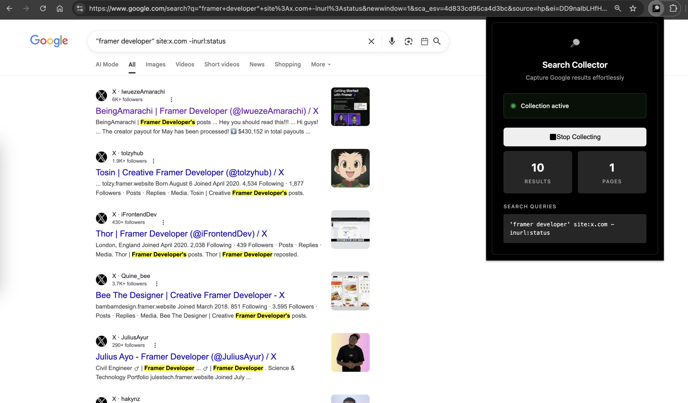
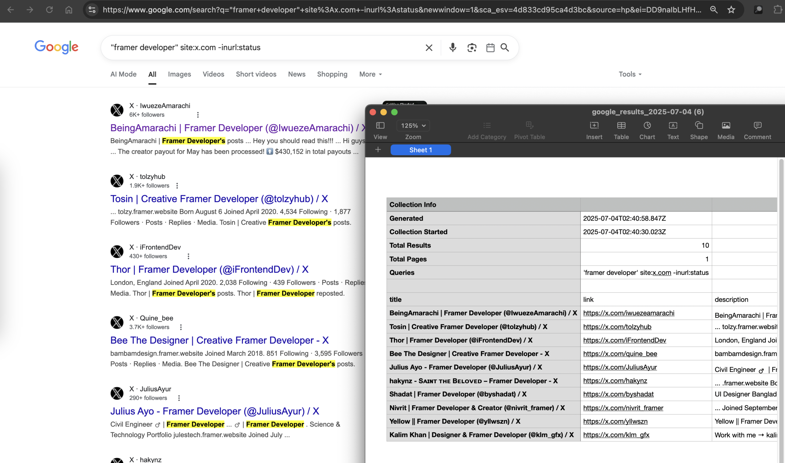

  
  
  # Google Search Results Collector

  A Chrome extension that automatically collects Google search results as you browse and exports them to CSV. Perfect for research, competitive analysis, and data collection.

  
  
  

## Features

- 🔍 **Automatic Collection**: Collects search results as you browse Google search pages
- 📊 **Real-time Stats**: Shows collected results count and pages visited
- 📁 **Auto-Export**: Automatically downloads CSV when you stop collecting
- 🌙 **Dark Mode**: Clean, modern interface with grayscale design
- 🧹 **Auto-Clean**: Data is cleared after each export for fresh collections
- 💾 **Persistent Storage**: Results are saved across browser sessions

## Preview

*Extension popup when collection is inactive*

*Extension popup when actively collecting results*

## How It Works

**Super simple 2-step process:**

1. **Start Collection**: Click the extension icon and press "Start Collecting"
2. **Browse & Stop**: Navigate Google search pages normally, then click "Stop Collecting" when done

That's it! The CSV file downloads automatically with all your collected search results, including:
- Search result titles
- URLs
- Descriptions  
- Page numbers
- Timestamps
- Search queries used

## Setup Instructions

1. **Download the extension:**
   - Download the `public` folder from the repository

2. **Load the extension in Chrome:**
   - Open Chrome and navigate to `chrome://extensions/`
   - Enable "Developer mode" in the top right corner
   - Click "Load unpacked" and select the downloaded `public` folder

3. **Start using:**
   - The extension icon will appear in your Chrome toolbar
   - Visit Google and start searching!

## Usage Tips

- ✅ Navigate naturally through Google search results
- ✅ Works across multiple search queries 
- ✅ Automatically deduplicates results
- ✅ Collection persists across browser tabs and sessions
- ✅ CSV includes metadata like collection date and query statistics

**Note:** Make sure to reload the extension and refresh Google search pages after installing.
